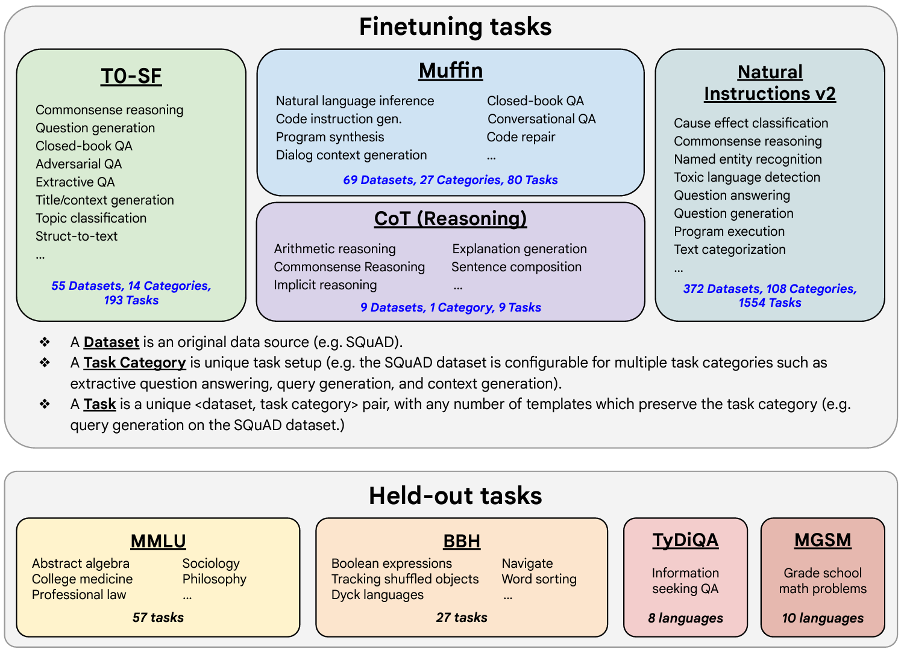

# Scaling instruct models

[This paper](https://arxiv.org/abs/2210.11416) introduces FLAN (Fine-tuned LAnguage Net), 
an instruction finetuning method, and presents the results of its application. 
The study demonstrates that by fine-tuning the 540B PaLM model on 1836 tasks while incorporating 
Chain-of-Thought Reasoning data, FLAN achieves improvements in generalization, human usability, 
and zero-shot reasoning over the base model. The paper also provides detailed information on how each 
these aspects was evaluated. 

Here is the image from the lecture slides that illustrates the fine-tuning tasks and datasets employed in 
training FLAN. The task selection expands on previous works by incorporating dialogue and program synthesis 
tasks from Muffin and integrating them with new Chain of Thought Reasoning tasks. It also includes 
subsets of other task collections, such as T0 and Natural Instructions v2. Some tasks were held-out during 
training, and they were later used to evaluate the model's performance on unseen tasks.

# Resources

Below you'll find links to the research papers discussed in this weeks videos. You don't need to understand all the 
technical details discussed in these papers - you have already seen the most important points you'll need to answer the 
quizzes in the lecture videos. 

However, if you'd like to take a closer look at the original research, you can read the papers and articles via the 
links below. 

## Generative AI Lifecycle
[Generative AI on AWS: Building Context-Aware, Multimodal Reasoning Applications](https://www.amazon.com/Generative-AI-AWS-Multimodal-Applications/dp/1098159225/)
 - This O'Reilly book dives deep into all phases of the generative AI lifecycle including model selection, fine-tuning, adapting, evaluation, deployment, and runtime optimizations.

## Multi-task, instruction fine-tuning
[Scaling Instruction-Finetuned Language Models](https://arxiv.org/pdf/2210.11416)
 - Scaling fine-tuning with a focus on task, model size and chain-of-thought data.

[Introducing FLAN: More generalizable Language Models with Instruction Fine-Tuning](https://research.google/blog/introducing-flan-more-generalizable-language-models-with-instruction-fine-tuning/)
 - This blog (and article) explores instruction fine-tuning, which aims to make language models better at performing NLP tasks with zero-shot inference.

## Model Evaluation Metrics
[HELM - Holistic Evaluation of Language Models](https://crfm.stanford.edu/helm/lite/latest/)
 - HELM is a living benchmark to evaluate Language Models more transparently. 

[General Language Understanding Evaluation (GLUE) benchmark](https://openreview.net/pdf?id=rJ4km2R5t7)
 - This paper introduces GLUE, a benchmark for evaluating models on diverse natural language understanding (NLU) tasks and emphasizing the importance of improved general NLU systems.

[SuperGLUE](https://super.gluebenchmark.com/)
 - This paper introduces SuperGLUE, a benchmark designed to evaluate the performance of various NLP models on a range of challenging language understanding tasks.

[ROUGE: A Package for Automatic Evaluation of Summaries](https://aclanthology.org/W04-1013.pdf)
 - This paper introduces and evaluates four different measures (ROUGE-N, ROUGE-L, ROUGE-W, and ROUGE-S) in the ROUGE summarization evaluation package, which assess the quality of summaries by comparing them to ideal human-generated summaries.

[Measuring Massive Multitask Language Understanding (MMLU)](https://arxiv.org/pdf/2009.03300)
 - This paper presents a new test to measure multitask accuracy in text models, highlighting the need for substantial improvements in achieving expert-level accuracy and addressing lopsided performance and low accuracy on socially important subjects.

[BigBench-Hard - Beyond the Imitation Game: Quantifying and Extrapolating the Capabilities of Language Models](https://arxiv.org/pdf/2206.04615)
 - The paper introduces BIG-bench, a benchmark for evaluating language models on challenging tasks, providing insights on scale, calibration, and social bias.

## Parameter- efficient fine tuning (PEFT)
[Scaling Down to Scale Up: A Guide to Parameter-Efficient Fine-Tuning](https://arxiv.org/pdf/2303.15647)
 - This paper provides a systematic overview of Parameter-Efficient Fine-tuning (PEFT) Methods in all three categories discussed in the lecture videos.

[On the Effectiveness of Parameter-Efficient Fine-Tuning](https://arxiv.org/pdf/2211.15583)
 - The paper analyzes sparse fine-tuning methods for pre-trained models in NLP.

## LoRA
[LoRA Low-Rank Adaptation of Large Language Models](https://arxiv.org/pdf/2106.09685)
 -  This paper proposes a parameter-efficient fine-tuning method that makes use of low-rank decomposition matrices to reduce the number of trainable parameters needed for fine-tuning language models.

[QLoRA: Efficient Finetuning of Quantized LLMs](https://arxiv.org/pdf/2305.14314)
 - This paper introduces an efficient method for fine-tuning large language models on a single GPU, based on quantization, achieving impressive results on benchmark tests.

## Prompt tuning with soft prompts
[The Power of Scale for Parameter-Efficient Prompt Tuning](https://arxiv.org/pdf/2104.08691)
 - The paper explores "prompt tuning," a method for conditioning language models with learned soft prompts, achieving competitive performance compared to full fine-tuning and enabling model reuse for many tasks.