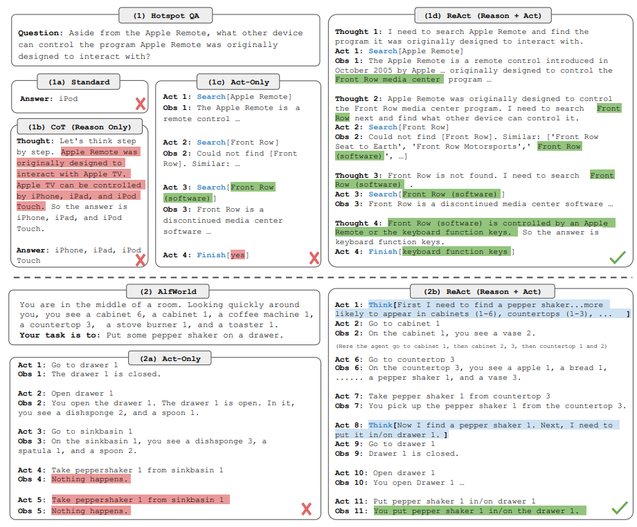

[This paper](https://arxiv.org/abs/2210.03629)
 introduces ReAct, a novel approach that integrates verbal reasoning and interactive decision making in large language models (LLMs). While LLMs have excelled in language understanding and decision making, the combination of reasoning and acting has been neglected. ReAct enables LLMs to generate reasoning traces and task-specific actions, leveraging the synergy between them. The approach demonstrates superior performance over baselines in various tasks, overcoming issues like hallucination and error propagation. ReAct outperforms imitation and reinforcement learning methods in interactive decision making, even with minimal context examples. It not only enhances performance but also improves interpretability, trustworthiness, and diagnosability by allowing humans to distinguish between internal knowledge and external information.

In summary, ReAct bridges the gap between reasoning and acting in LLMs, yielding remarkable results across language reasoning and decision making tasks. By interleaving reasoning traces and actions, ReAct overcomes limitations and outperforms baselines, not only enhancing model performance but also providing interpretability and trustworthiness, empowering users to understand the model's decision-making process.

Image: The figure provides a comprehensive visual comparison of different prompting methods in two distinct domains. The first part of the figure (1a) presents a comparison of four prompting methods: Standard, Chain-of-thought (CoT, Reason Only), Act-only, and ReAct (Reason+Act) for solving a HotpotQA question. Each method's approach is demonstrated through task-solving trajectories generated by the model (Act, Thought) and the environment (Obs). The second part of the figure (1b) focuses on a comparison between Act-only and ReAct prompting methods to solve an AlfWorld game. In both domains, in-context examples are omitted from the prompt, highlighting the generated trajectories as a result of the model's actions and thoughts and the observations made in the environment. This visual representation enables a clear understanding of the differences and advantages offered by the ReAct paradigm compared to other prompting methods in diverse task-solving scenarios.